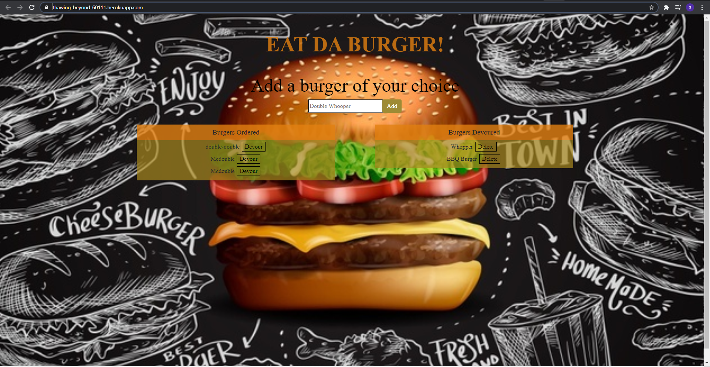

# Eat-Da-Burger

Here's a simple application that allows you to add any burger of your choice. It then adds it to the waiting list to be devoured once devoured it's move to the devoured list.
If devoured list is starting to get full you have the option to delete the burgers from the list. This application utilizes mysql, express, node and handlebars.

Here's a screen shot of the deployed site:

Here's a link to deploy app.\
https://thawing-beyond-60111.herokuapp.com/